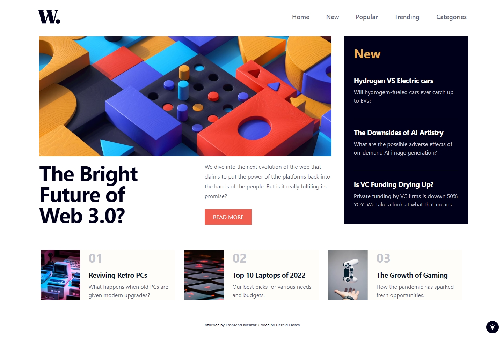
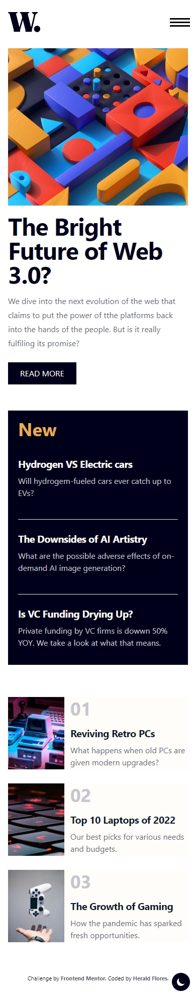

# Frontend Mentor - News homepage solution

This is a solution to the
[News homepage challenge on Frontend Mentor](https://www.frontendmentor.io/challenges/news-homepage-H6SWTa1MFl).
Frontend Mentor challenges help you improve your coding skills by building
realistic projects.

## Table of contents

- [Frontend Mentor - News homepage solution](#frontend-mentor---news-homepage-solution)
	- [Table of contents](#table-of-contents)
	- [Overview](#overview)
		- [The challenge](#the-challenge)
		- [Screenshot](#screenshot)
			- [Design Preview:](#design-preview)
			- [Screenshot Solution](#screenshot-solution)
				- [Desktop](#desktop)
				- [Mobile](#mobile)
		- [Links](#links)
	- [My process](#my-process)
		- [Built with](#built-with)
		- [🚀 Project Structure](#-project-structure)
		- [🧞 Commands](#-commands)
		- [What I learned](#what-i-learned)
		- [Continued development](#continued-development)
		- [Useful resources](#useful-resources)
	- [Author](#author)
	- [Acknowledgments](#acknowledgments)


## Overview

### The challenge

Users should be able to:

- View the optimal layout for the interface depending on their device's screen
  size
- See hover and focus states for all interactive elements on the page

### Screenshot

#### Design Preview:


#### Screenshot Solution

##### Desktop



##### Mobile



### Links

- Solution URL: [GitHub Repo](https://github.com/Herald-Flores/news-homepage)
- Live Site URL: [Live](https://github.com/Herald-Flores/news-homepage)

## My process

### Built with

- Semantic HTML5 markup
- Styling with css flex and grid
- Using Tailwind CSS
- Add Dark and Light Mode Aditional to the challenge
- Mobile-first workflow
- Basic implementation of clean architecture for component structure
- [Astro](https://astro.build/) - Web Framework
- [Tailwind](https://tailwindcss.com/) - CSS Framework
- Local Environment:
  - [VSCode](https://code.visualstudio.com/) - Code Editor
  - [PNPM](https://pnpm.io/) - Node package Manager
  - [ESLint](https://eslint.org/) - Linter
  - [Prettier](https://prettier.io/) - Code Formater


### 🚀 Project Structure

Project folders and files:

```text
/
├── public/
│   └── image/
│		└── favicon-32x32.png
├── src/
│   ├── components/
│   │   └── CardFeature/
│   │   	└── Components/
│   │   	│	└── PictureCard.astro
│   │   	└── CardFeture.astro
│   ├── layouts/
│   │   └── Layout.astro
│   └── pages/
│       └── index.astro
└── package.json
```

### 🧞 Commands

All commands are run from the root of the project, from a terminal:

| Command                    | Action                                           |
| :------------------------- | :----------------------------------------------- |
| `pnpm install`             | Installs dependencies                            |
| `pnpm run dev`             | Starts local dev server at `localhost:4321`      |
| `pnpm run build`           | Build your production site to `./dist/`          |
| `pnpm run preview`         | Preview your build locally, before deploying     |
| `pnpm run astro ...`       | Run CLI commands like `astro add`, `astro check` |
| `pnpm run astro -- --help` | Get help using the Astro CLI                     |

### What I learned

- Learn how to use Astro 3 framework, use components, ayouts and pages. 
- Implement Taildwind Css with Astro and configure ESLint and prettier for validations and code formatting.
- Mobile First Workflow


To see how you can add code snippets, see below:

Astro Layout and Components
```astro
<Header />
<main class='box-border max-w-screen-xl mx-auto mt-2'>
	<slot />
</main>
<Footer />
```

Load Color Theme with JS
```js
if (localStorage.getItem('color-theme') === 'dark' || (!('color-theme' in localStorage) && window.matchMedia('(prefers-color-scheme: dark)').matches)) {
	document.documentElement.classList.add('dark')
} else {
	document.documentElement.classList.remove('dark')
}
```

### Continued development

I will continue to practice mobile first and implement good practices in web layout to better adapt the designs to the web.


### Useful resources

- [Astro Doc](https://docs.astro.build/en/getting-started/) - The official documentation helps me to understand the framework and the characteristics of the technology I am using.
- [Tailwind CSS](https://tailwindcss.com/docs/installation) - UI framework references

## Author

- Website - [Herald Flores](https://github.com/Herald-Flores)
- Frontend Mentor -
  [@Herald-Flores](https://www.frontendmentor.io/profile/Herald-Flores)


## Acknowledgments

Thanks to [midudev](https://midu.dev/) for his Astro course and all of his content, it helped me to understand more easily the framework.
